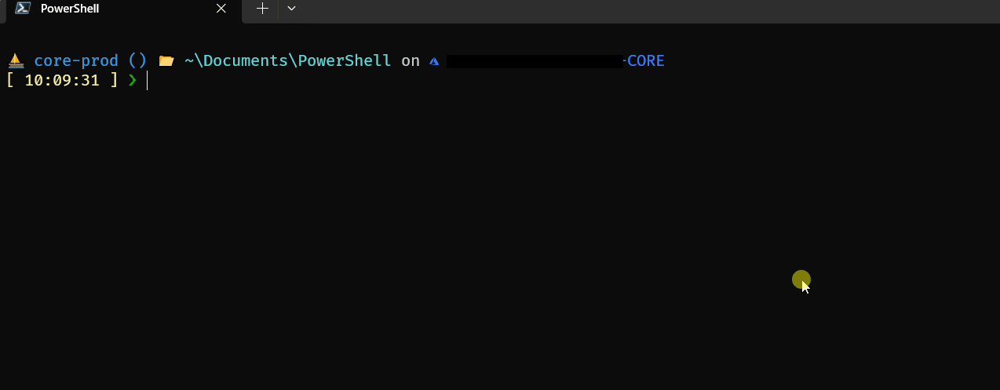

# Ksub - Kubernetes Subscription and Context Switcher
Ksub is a command-line tool for switching between Azure subscriptions and Kubernetes clusters with ease.

## Last Build
[](https://github.com/VegaCorporoptions/Ksub/actions/workflows/go.yml)

## Prerequisites
Before using this tool, ensure you have the following prerequisites:

- Azure CLI (az) installed and configured.
- kubectl installed and configured with access to your Kubernetes clusters.
- kubectx installed

## Installation
Clone the repository to your local machine:

```bash
git clone https://github.com/VegaCorporoptions/Ksub
cd your-repo
```

Build the Go application:
You need to change **const** `regexSubToCluster` in main.go with your regex
```bash
go build .
```

## Download Ksub Executable
You can download the executable for Ksub directly from the latest release with its version. This allows you to use Ksub without the need to build it yourself. Here are the steps to download the executable for your system:
1. Visit the [Releases](https://github.com/VegaCorporoptions/Ksub/releases/latest) page.

## Usage
Ksub allows you to switch between Azure subscriptions and Kubernetes clusters efficiently. Here's how to use it:

Run the Ksub application:
```bash
ksub
```
Select an Azure subscription from the list.  
Ksub will change your Azure subscription context to the selected one.  
Ksub will also switch your Kubernetes context to the corresponding cluster if available.

## Demo


## License
This project is licensed under the MIT License. See the LICENSE file for details.
